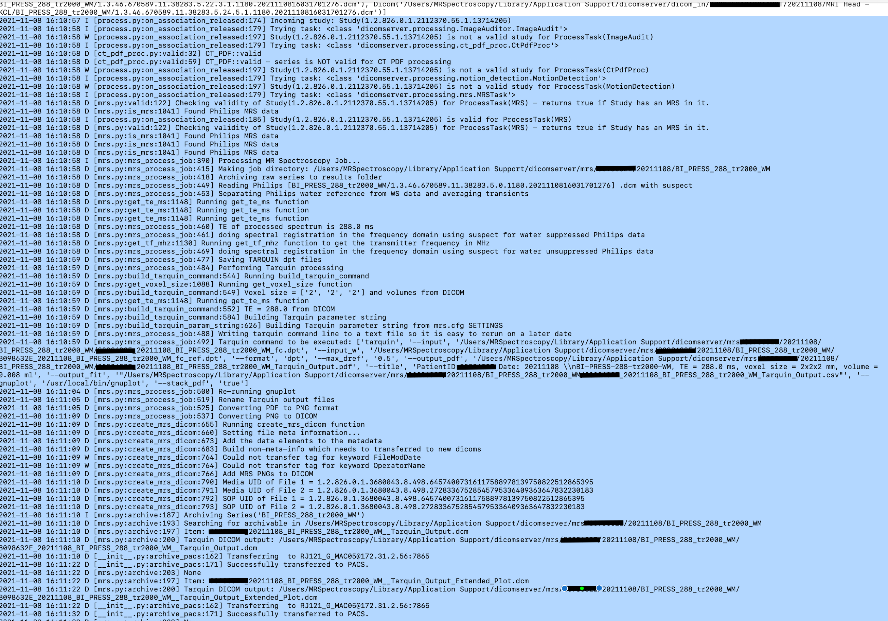
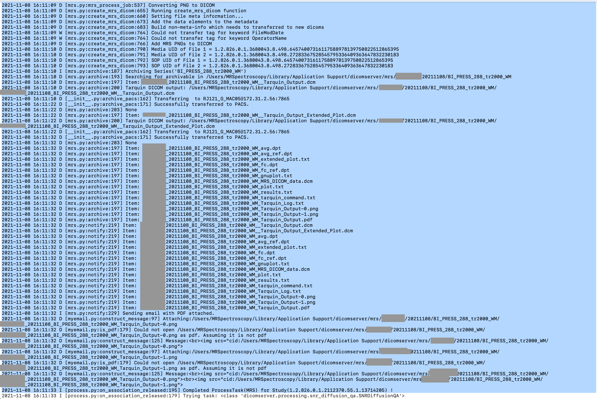

# \<MRSpectroscopy\> - Software Validation Form

## 1. Information about the Software

|           |                                          |
|-----------|------------------------------------------|
| QMS ID    | \<0018\>                                 |
| Name      | \<MRSpectroscopy\>                       |
| Version   | \<1.0.0\>                                |
| Location  | \<https://github.com/GSTT-CSC/0018-ds-mr-spectroscopy\>                                  |

## 2. Intended Use and Use Context
This software is a dicomserver plugin that is used to automatically analyse MR Spectroscopy data and create a dicom encapsualated PDF of the results and send them
to PACS.

## 3. Quality Relevance

*Rate these aspects with yes (y) or no (n). If any of these aspects is rated as yes, the system is quality
relevant and should be validated.*

| **Criterion**                                                                                                                         | **Y/N** |
|---------------------------------------------------------------------------------------------------------------------------------------|---------|
| Is the system used in one or more processes that steer the QMS?                                                                       |    N    |
| Could the conformity of the organization’s medical devices be affected if the system does not work according to its specifications?   |    N    |
| Could risks arise for patients, users, third parties or the organization if the system does not work according to its specifications? |    Y    |
| Does the software generate or manage data / records that are relevant to the QMS or medical device approval by authorities?           |    Y    |
| Is the software used to generate electronic signatures on documents or records required by the QMS and/or state authorities?          |    N    |

## 4. General Assessment

### 4.1 Software Category

* Custom (self-developed) software (GAMP category 5)

### 4.2 Risk Assessment

**List of Risks:**

See document "./hazard-log.md"

**List of Risk Mitigation Measures (if necessary):**

See document "./hazard-log.md"

### 4.3 Criticality and Review Schedule

*Refer to section 10 for descriptions of the criticality classifications. If a software is not highly critical
and widely adopted / commonly used, it can be continuously re-validated during use.*

**Moderate** (review every year)
## 5. Validation Plan

### 5.1 Participants

| Role | Name | Task(s) |
|------|------|---------|
|      |      |         |

### 5.2 Test Environment

* Software tool running on Mac OS X 10.11.6 (El Capitan)

### 5.3 Testing Procedure

* Passing data through the software and recording output
* See document "./verification-validation-plan.md"

## 6. Validation Report and Requirements

### 6.1 Acceptance Criteria

The software is approved for use if it is validated successfully and works as expected.

### 6.2 Validation of Usage Requirements

| ID     | Expected                                                                                              | Result                                                                                           | Pass? |
|--------|-------------------------------------------------------------------------------------------------------|--------------------------------------------------------------------------------------------------|-------|
| SRS001 | The application must integrate with dicomserver in order to receive dicom data from MR Scanners       | The application runs on the dicomserver platofrm and can received data from mr scanners          | Yes   |
| SRS002 | The application must produce a dicom enscapusulated PDF of the analysis for archiving by dicomserver. | A dicom encapsulate pdf was archived and accessible on PACs                                      | Yes   |
| SRS003 | The application must be able to return a result within 10 minutes.                                    | Total processing time was recoded as 33 seconds for a representative incoming series (see below) | Yes   |
| SRS004 | The application must be able to accurately measure the metabolites quantities in MR Spectroscopy data |                                                                                                  | -     |

### 6.3 Validation of Technical Requirements

| ID      | Expected                                                                                                                           | Result                                                                                | Pass? |
|---------|------------------------------------------------------------------------------------------------------------------------------------|---------------------------------------------------------------------------------------|-------|
| SDS-001 | The software shall be written as a dicomserver plugin.                                                                             | The software inherits from the ProcessTask superclass and integrates with dicomserver | Yes   |
| SDS-002 | The software shall convert the analysis report into a PDF and use an appropriate library                                           | PDF files are successfully created after processing                                   | Yes   |
| SDS-003 | The software shall use the (Tarquin)[http://tarquin.sourceforge.net] software to perform the metabolite fitting and quantification | Tarquin is used to process incoming series                                            | Yes   |
| SDS-004 | The software shall use test data with known metabolite quantities to perform regression and accuracy testing.                      |                                                                                       | -     |

### 6.4 Summary of Validation

| Type                   | Total | Pass | Fail |
|------------------------|-------|------|------|
| Usage Requirements     | 4     | 3    | -    |
| Technical Requirements | 4     | 3    | -    |

### 6.5 Conclusion

 

## 7. Proof of Validation

> You can optionally insert screenshots for proof of validation. Strictly speaking, this is not a hard
> requirement by the standards but it's nice to show when you're being audited.

|                                   |                          |
|-----------------------------------|--------------------------|
| SRS001, SRS003, SDS-001, SDS-003, |   |

## 8. Approval and Release

| **Date of Approval** | **Name of Approver** |
|----------------------|----------------------|
| \<date\>             | \<name\>             |

## 9. History

| Date | Name | Activity             |
|------|------|----------------------|
|      |      | \<Initial Approval\> |

## 10. Annex: Additional Information for Criticality Classification

**Criticality High**

* A software failure can lead to physical harm requiring medical intervention
* Software controls parameters or data that are essential during product release
* Software manages data relevant for clinical evaluation or product approval
* Software manages data from which conclusions about incident messages or recall actions are drawn

**Criticality Moderate**

* A software failure can lead to physical damage requiring medical intervention
* Software administers documents whose loss endangers the certification
* Software controls intermediate results in the product realization, which are revealed in later steps by
  other processes

**Criticality Low**

* Software manages documents that play a role in the QM system, and whose loss would lead to an audit variance

---

Template Copyright [openregulatory.com](https://openregulatory.com). See [template
license](https://openregulatory.com/template-license).

Please don't remove this notice even if you've modified contents of this template.
